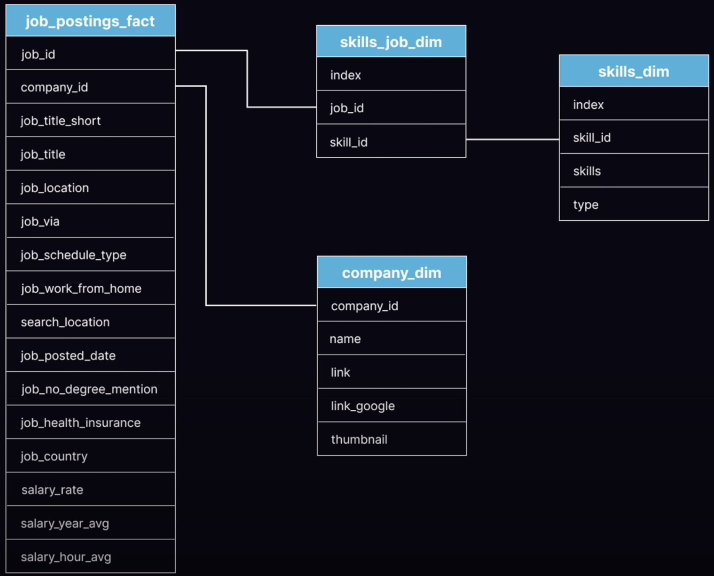

# SQL_Project_Data_Job_Analysis
## Introduction
Dive into the data job market!
Check SQL queries here: [project_sql folder](/project_sql/)


## Background
Data hails from [SQL Course](https://lukebarousse.com/sql)
## The questions I wanted to answer through the SQL quereies:
1. What are the top-paying data analyst jobs?
2. What skills are required for these top-paying jobs?
3. What skills are most in demand for data analysts?
4. Which skills are associated with higher salaries?
5. What are the most optimal skills to learn?
## Tools I Used
- **SQL**: The backbone of my analysis
- **PostgreSQL**: The chosen database management system, ideal for handling the job posting data
- **Visual Studio Code**: My go-to for database management and executing SQL queries
- **Git & GitHub**: Essential for version control and sharing my SQL scripts and analysis, ensuring collaboration and project tracking
## The Analysis
```sql
SELECT
    job_id,
    job_title,
    job_location,
    job_schedule_type,
    salary_year_avg,
    job_posted_date,
    name AS company_name
FROM
    job_postings_fact
LEFT JOIN
    company_dim
USING
    (company_id)
WHERE
    job_title_short = 'Data Analyst'
    AND
    job_location = 'Anywhere'
    AND
    salary_year_avg IS NOT NULL
ORDER BY
    salary_year_avg DESC
LIMIT 10;
```